## Оглавление

1. [Настройка gitlab-runner](#part-1-настройка-gitlab-runner)
2. [Сборка](#part-2-сборка)
3. [Тест кодстайла](#part-3-тест-кодстайла)
4. [Итеграционные тесты](#part-4-интеграционные-тесты)
5. [Этап деплоя](#part-5-этап-деплоя)
6. [Дополнительно. Уведомления](#part-6-дополнительно-уведомления)

## Part 1. Настройка gitlab-runner

- Поднять виртуальную машину Ubuntu Server 22.04 LTS = **Готово**.
   + Скачать и установить  Ubuntu Server 22.04 LTS на ВМ = **Готово**.
   + Выполнить команду `cat /etc/issue` чтобы узнать версию Ubuntu = **Готово**.
   + Вставить скриншот с выводом команды = **Готово**.

<!-- -->
<figure>
  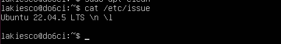
  <figcaption>Вывод команды с версией ОС</figcaption>
</figure>

Скачал отсюда: https://ubuntu.com/download/server/thank-you?version=22.04.5&architecture=amd64&lts=true

- Скачать и установить на виртуальную машину gitlab-runner = **Готово**.
   + Выполнить команды `sudo apt update`, `sudo apt upgrade`, `sudo apt install -y curl git` для обновления пакетов, установки утилиты curl и git'a = **Готово**.
   + Выполнить команду `curl -L https://packages.gitlab.com/install/repositories/runner/gitlab-runner/script.deb.sh | sudo bash` для добавления репозитория в систему = **Готово**.
   + Выполнить команду `sudo apt install -y gitlab-runner` для установки gitlab-runner`a = **Готово**.  
   + Выполнить команду `gitlab-runner --version` для проверки установился ли gitlab-runner = **Готово**.  
   + Вставить скриншоты с выводом команд = **Готово**.  

<!-- -->
<figure>
  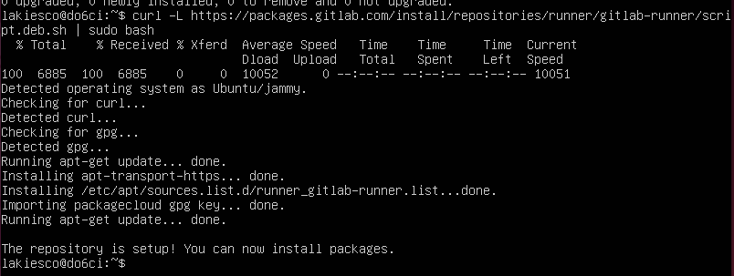
  <figcaption>Вывод результата выполнения команды добавления репозитория</figcaption>
</figure>

<!-- -->
<figure>
  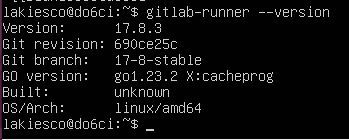
  <figcaption>Вывод результата выполнения команды проверки установки</figcaption>
</figure>

<!-- 
Дополнительно установил
sudo apt install make   \\ make --version
sudo apt install gcc    \\ gcc --version
sudo apt install clang  \\ clang --version
sudo apt install clang-format  \\ clang-format --version
-->
- Запустить gitlab-runner и зарегистрировать его для использования в текущем проекте (DO6_CICD) = **Готово**.
   + Выполнить команду `systemctl status gitlab-runner.service` для проверки запущен ли gitlab-runner = **Готово**. 
   + Выполнить команду `sudo gitlab-runner register` для регистрации и ввести требуемые данные = **Готово**.   

<!-- -->
<figure>
  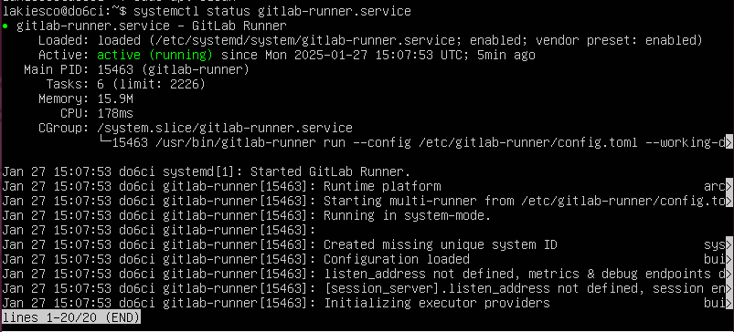
  <figcaption>Вывод результата выполнения команды проверки запущен ли runner</figcaption>
</figure>

Данные для заполнения:
- URL-адрес: https://repos.21-school.ru 
- Токен: GR13**************vRV
- Название runner'a: DO6_CICD_lakiesco
- Теги для заданий, разделенные запятыми: build, style, test, deploy
- Тип runner'a: shell

## Part 2. Сборка

- Написать этап для CI по сборке приложений из проекта C2_SimpleBashUtils = **Готово**.
   + Выполнить команду `touch .gitlab-ci.yml` для создания файла в корневой папке проекта = **Готово**.
   + Выполнить команду `sudo nano .gitlab-ci.yml` для открытия файла = **Готово**.
   + В редакторе nano описываем сборку, как того требуется по заданию = **Готово**.
      - В файле `gitlab-ci.yml` добавить этап запуска сборки через мейк файл из проекта C2 = **Готово**.
      - Файлы, полученные после сборки (артефакты), сохранить в произвольную директорию со сроком хранения 30 дней = **Готово**.
   + Вставить скриншот с содержанием файла `.gitlab-ci.yml` = **Готово**.
   + Вставить скриншот из сборочной линии со статусом сборки = **Готово**.
   + Вставить скриншот с подробностями выполнения задания = **Готово**.  
   + Вставить скриншоты с наличием артефактов после выполнения задания = **Готово**. 

<!-- -->
<figure>
  
  <figcaption>Скриншот с содержанием файла `.gitlab-ci.yml`</figcaption>
</figure>

<!-- -->
<figure>
  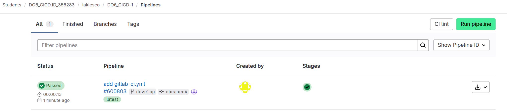
  <figcaption>Скриншот со статусом сборки</figcaption>
</figure>

<!-- -->
<figure>
  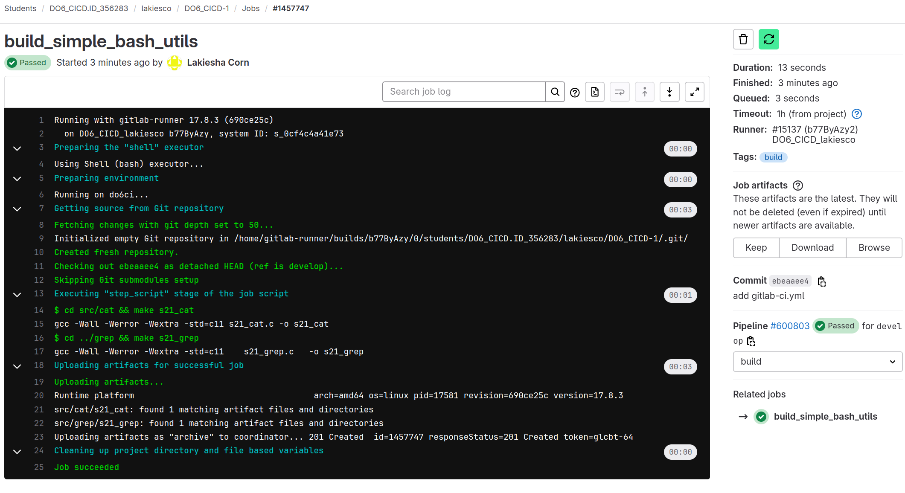
  <figcaption>Скриншот с подробностями выполнения задания</figcaption>
</figure>

<!-- -->
<figure>
  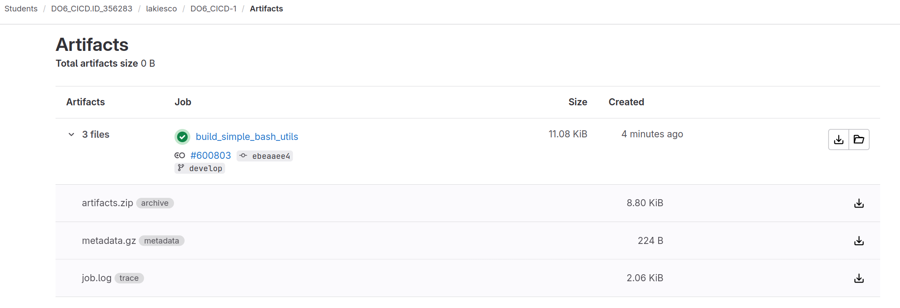
  <figcaption>Скриншот с наличием артефактов после выполнения задания</figcaption>
</figure>

## Part 3. Тест кодстайла

- Написать этап для CI, который запускает скрипт кодстайла (clang-format) = **Готово**.
   + Выполнить команду `touch test_style.sh` для создания файла скрипта = **Готово**.
   + Выполнить команду `sudo nano test_style.sh` для открытия файла = **Готово**.
   + В редакторе nano описываем скрипт, как того требуется по заданию = **Готово**.
   + Выполнить команду `chmod +x test_style.sh` чтобы сделать файл исполняемым = **Готово**. 
   + Вставить скриншот с содержанием файла `test_style.sh` = **Готово**.
   + Выполнить команду `sudo nano .gitlab-ci.yml` для редактирования файла = **Готово**.
      - В редакторе nano добавляем в сборку этап style = **Готово**.
   + Вставить скриншот с содержанием измененного файла `.gitlab-ci.yml` = **Готово**. 
- Если кодстайл не прошел, то «зафейли» пайплайн = **Готово**.
   + Выполнить команду `nano s21_cat.c` и вносим небольшие изменения, чтобы clang сработал = **Готово**.
   + Выполняем push с новым скриптом, yml-файлом и внесенной в код файла s21_cat.c ошибкой = **Готово**. 
- В пайплайне отобразить вывод утилиты clang-format = **Готово**.
   + Вставить скриншоты с результатом работы сборочной линии и задания style с ошибкой стиля = **Готово**.
   + Выполнить команду `nano s21_cat.c` и возвращаем код в исходное состояние = **Готово**. 
   + Вставить скриншоты с результатом работы сборочной линии и задания style без ошибки стиля = **Готово**.      

<!-- -->
<figure>
  
  <figcaption>Скриншот с содержанием файла `test_style.sh`</figcaption>
</figure>

<!-- -->
<figure>
  
  <figcaption>Скриншот с содержанием измененного файла `.gitlab-ci.yml`</figcaption>
</figure>

<!-- -->
<figure>
  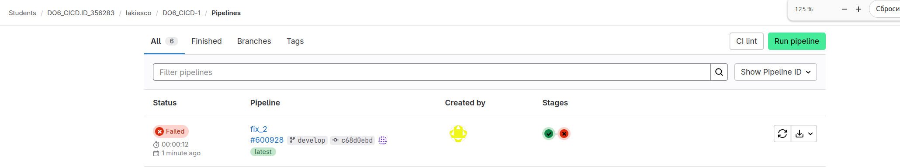
  <figcaption>Скриншот со статусом из сборочной линии при ошибке</figcaption>
</figure>

<!-- -->
<figure>
  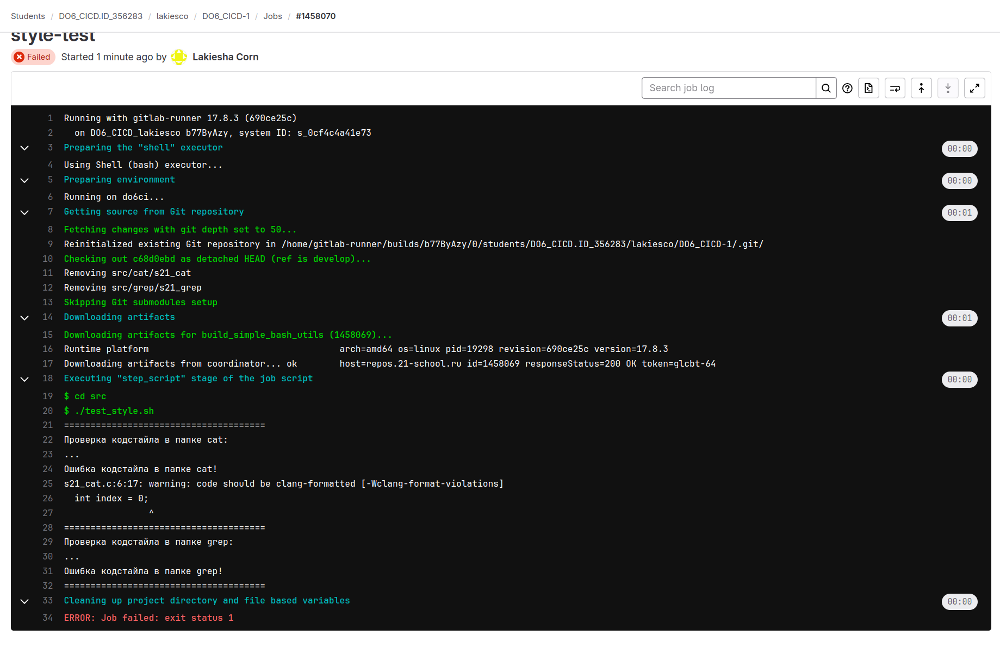
  <figcaption>Скриншот с подробностями выполнения задания при ошибке</figcaption>
</figure>

<!-- -->
<figure>
  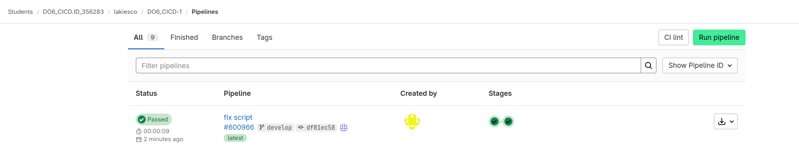
  <figcaption>Скриншот со статусом из сборочной линии с успехом</figcaption>
</figure>

<!-- -->
<figure>
  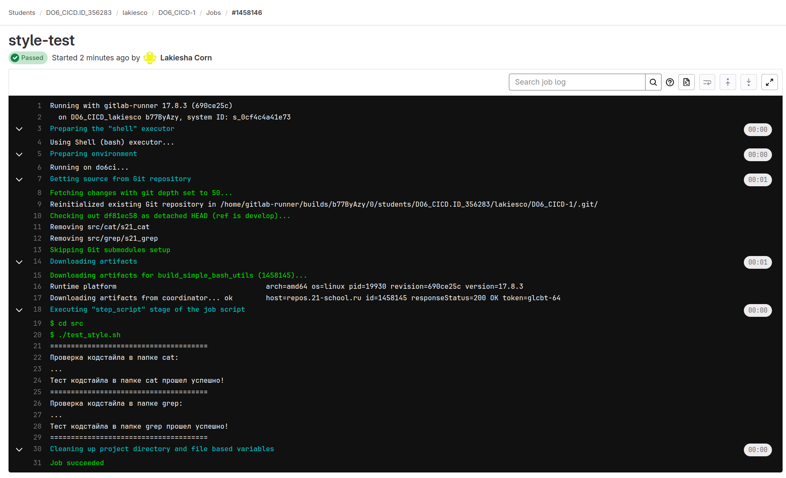
  <figcaption>Скриншот с подробностями выполнения задания с успехом</figcaption>
</figure>

## Part 4. Интеграционные тесты

- Написать этап для CI, который запускает твои интеграционные тесты из того же проекта = **Готово**. 
   + Выполнить команду `sudo nano .gitlab-ci.yml` для редактирования файла = **Готово**.
   + В редакторе nano добавляем в сборку этап test = **Готово**.
   + Вставить скриншот с содержанием измененного файла `.gitlab-ci.yml` = **Готово**. 
  
<!-- -->
<figure>
  
  <figcaption>Скриншот с содержанием измененного файла `.gitlab-ci.yml`</figcaption>
</figure>

- Запустить этот этап автоматически только при условии, если сборка и тест кодстайла прошли успешно = **Готово**.
   + Выполнить команду `nano s21_cat.c` и вносим небольшие изменения, чтобы clang сработал = **Готово**.
   + Выполняем push с новым скриптом, yml-файлом и внесенной в код файла s21_cat.c ошибкой = **Готово**.
   + Вставить скриншоты с результатом работы сборочной линии и задания test с ошибкой на этапе сборки\стиля = **Готово**. 

<!-- -->
<figure>
  
  <figcaption>Скриншот со статусом из сборочной линии при ошибке на этапах test или style</figcaption>
</figure>

<!-- -->
<figure>
  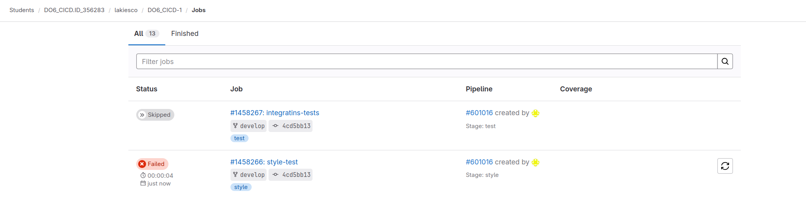
  <figcaption>Скриншот со статусом из задания при ошибке на этапах test или style</figcaption>
</figure>

- Если тесты не прошли, то «зафейли» пайплайн = **Готово**.
- В пайплайне отобрази вывод, что интеграционные тесты успешно прошли / провалились = **Готово**.
   + Выполнить команду `nano s21_cat.c` и возвращаем код в исходное состояние = **Готово**.
   + Выполнить команду `nano Makefile` и вносим небольшие изменения, чтобы этап tets не сработал = **Готово**.   
   + Вставить скриншоты с результатом работы сборочной линии и задания test с ошибкой на этапе test'a = **Готово**.
   + Выполнить команду `nano Makefile` и возвращаем код в исходное состояние, чтобы этап tets сработал успешно = **Готово**.     
   + Вставить скриншоты с результатом работы сборочной линии и задания test с ошибкой на этапе теста = **Готово**. 
   + Вставить скриншоты с результатом работы сборочной линии и задания test без ошибок на этапе теста = **Готово**.
   + Вставить скриншоты с наличием артефактов после выполнения задания = **Готово**. 

<!-- -->
<figure>
  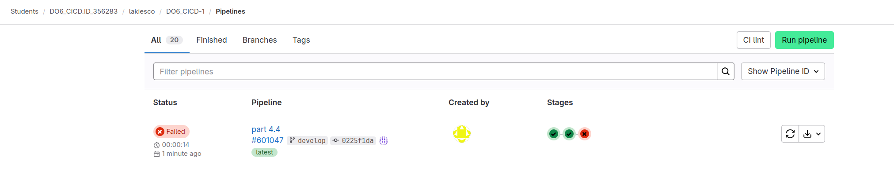
  <figcaption>Скриншот со статусом из сборочной линии при ошибке на этапe test'a</figcaption>
</figure>

<!-- -->
<figure>
  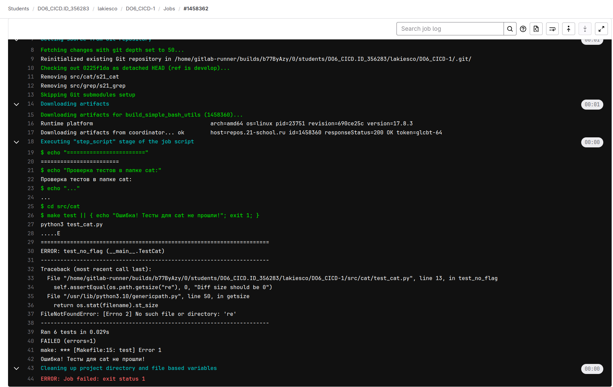
  <figcaption>Скриншот с подробностями выполнения задания при ошибке на этапe test'a</figcaption>
</figure>

<!-- -->
<figure>
  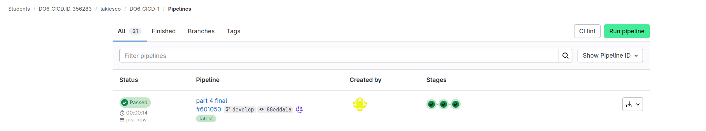
  <figcaption>Скриншот со статусом из сборочной линии при успехе на этапe test'a</figcaption>
</figure>

<!-- -->
<figure>
  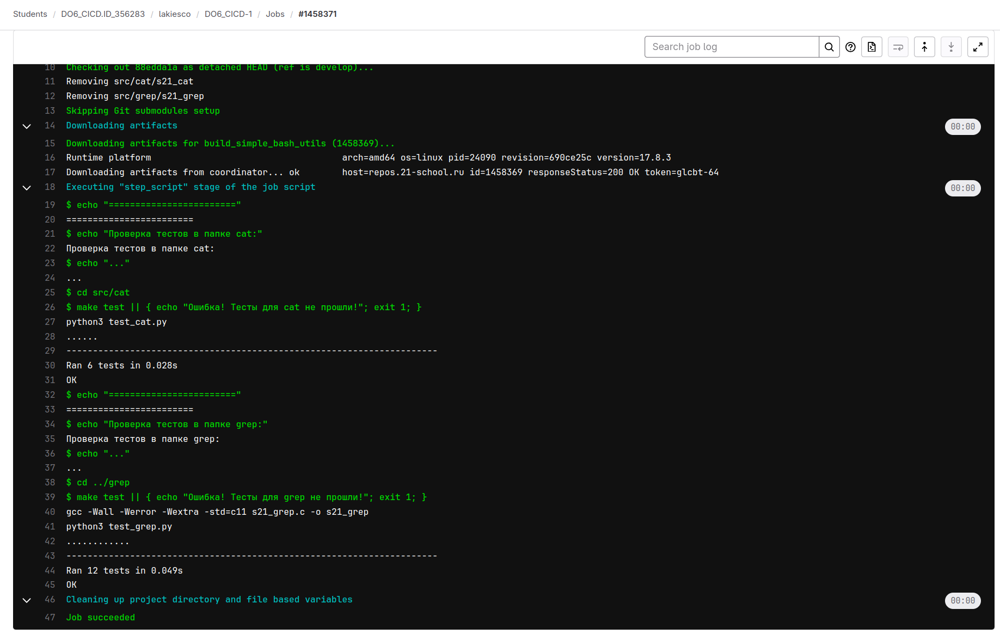
  <figcaption>Скриншот с подробностями выполнения задания при успехе на этапe test'a</figcaption>
</figure>

## Part 5. Этап деплоя

Part 5. Этап деплоя

- Поднять вторую виртуальную машину Ubuntu Server 22.04 LTS = **Готово**.
   + Установить  Ubuntu Server 22.04 LTS на вторую ВМ = **Готово**.
   + Вставить скриншот с двумя ВМ в VirtualBox = **Готово**. 
   + Выполнить команду `cat /etc/issue` чтобы узнать версию Ubuntu = **Готово**.
   + Вставить скриншот с выводом команды = **Готово**.
   + Выполнить команду `sudo apt remove gitlab-runner` для удаления runner'a со 2 ВМ = **Готово**.
   + Вставить скриншот с результатом выполнения команды удаления runner'a = **Готово**.   

<!-- -->
<figure>
  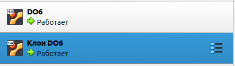
  <figcaption>Две ВМ в VirtualBox</figcaption>
</figure>

<!-- -->
<figure>
  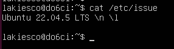
  <figcaption>Вывод команды с версией ОС</figcaption>
</figure> 

<!-- -->
<figure>
  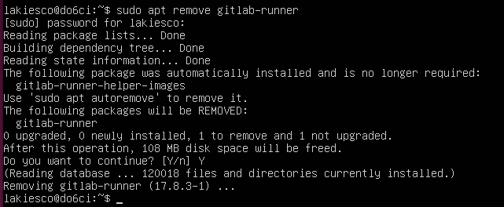
  <figcaption>Удаление runner'a со 2 ВМ</figcaption>
</figure>

- Выполнить подготовку к переносу исполняемых файлов на другую ВМ, которая будет играть роль продакшна = **Готово**.
   + Настроить взаимодействие между двумя ВМ = **Готово**.
   + Выполнить команды `ping 192.168.1.11 -c 3` с ВМ1 к ВМ2 и `ping 192.168.1.10 -c 3` с ВМ2 к ВМ1 для проверки связности = **Готово**. 
   + Вставить скриншоты с результатом выполнения команд ping'a = **Готово**.  
   + Выполнить команду `sudo su gitlab-runner` на машине с runner'ом для переключения на пользователя gitlab-runner = **Готово**.
   + Выполнить команду `ssh-keygen -t rsa -b 2048` для генерации ключей на машине с runner'ом = **Готово**.
   + Выполнить команду `ssh-copy-id lakiesco@192.168.1.11` на машине с runner'ом для установки ключей = **Готово**.
   + Выполнить команду `ssh lakiesco@192.168.1.11` на машине с runner'ом = **Готово**.
   + Выполнить команду `ssh-keygen -t rsa -b 2048` для генерации ключей на второй машине = **Готово**.
   + Выполнить команду `ssh-copy-id  lakiesco@192.168.1.10` на второй машине для установки ключей = **Готово**.
   + Выполнить команды `sudo chmod 777 /usr/local/bin` и `sudo chown -R $(whoami) /usr/local/bin` на второй машине для выдачи сопутствующих прав = **Готово**.
   + Вставить скриншоты выполнения команд = **Готово**. 
   + Тестирование подключения и передачи файлов = **Готово**. 
      - Выполнить команду `echo "Test" > test_CICD.txt`, создаем тестовый файл для передачи на машине с runner'ом = **Готово**.
      - Выполнить команду `scp test_CICD.txt lakiesco@192.168.1.11:/tmp/`, передаем файл между машинами = **Готово**.
      - Выполнить команду `ssh lakiesco@192.168.1.11 ls -l /tmp/test_CICD.txt`, проверяем, что файл передан и находится на второй машине = **Готово**.
      - Вставить скриншот выполнения команд = **Готово**.
      - Переходим на вторую машине в папку tmp и смотрим, что файл есть в папке = **Готово**.
      - Вставить скриншот содержания папки с тестовым файлом = **Готово**.       

<!-- -->
<figure>
  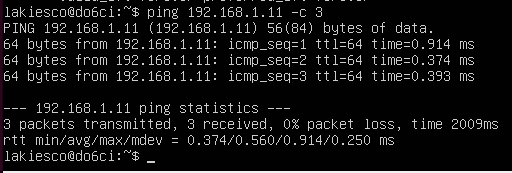
  <figcaption>Результат выполнения команды ping'a c ВМ1 на ВМ2</figcaption>
</figure>

<!-- -->
<figure>
  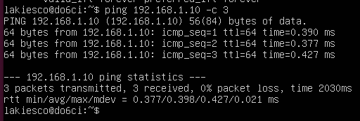
  <figcaption>Результат выполнения команды ping'a c ВМ2 на ВМ1</figcaption>
</figure>

<!-- -->
<figure>
  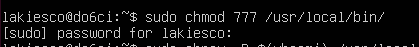
  <figcaption>Скриншот выполнения команды выдачи прав доступа к папке</figcaption>
</figure>

<!-- -->
<figure>
  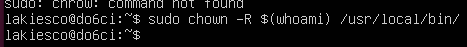
  <figcaption>Скриншот выполнения команды по выдаче прав доступа</figcaption>
</figure>

<-- Возврат к стандартному состоянию
sudo chown -R root:root /usr/local/bin
 -->

<!-- -->
<figure>
  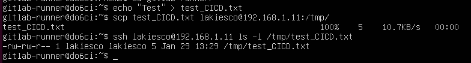
  <figcaption>Скриншот выполнения команд по передаче файла и проверке</figcaption>
</figure>

<!-- -->
<figure>
  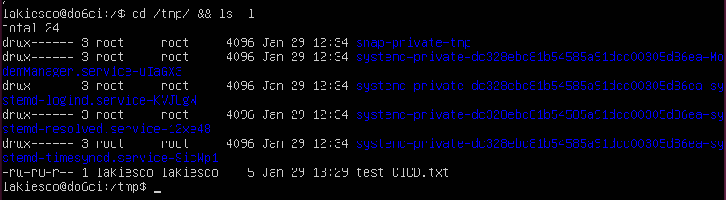
  <figcaption>Скриншот с содержания папки с тестовым файлом на второй машине</figcaption>
</figure>

- Написать этап для CD, который «разворачивает» проект на другой виртуальной машине = **Готово**.
   + Выполнить команду `sudo nano .gitlab-ci.yml` для редактирования файла = **Готово**.
   + В редакторе nano добавляем в сборку этап deploy = **Готово**.
   + Вставить скриншот с содержанием измененного файла `.gitlab-ci.yml` = **Готово**. 
   + Запустить этот этап вручную при условии, что все предыдущие этапы прошли успешно = **Готово**.
   + Вставить скриншот с шагом ручного запуска этапа deploy = **Готово**.    
   + Написать bash-скрипт, который при помощи ssh и scp копирует файлы, полученные после сборки (артефакты), в директорию /usr/local/bin второй виртуальной машины.
      - Выполнить команду `touch deploy.sh` для создания файла скрипта = **Готово**.
      - Выполнить команду `sudo nano deploy.sh` для открытия и наполнения файла = **Готово**.
      - Выполнить команду `chmod +x deploy.sh` чтобы сделать файл исполняемым = **Готово**.
      - Вставить скриншот с содержанием написанного скрипта `deploy.sh` = **Готово**.    
   + В файле gitlab-ci.yml добавить этап запуска написанного скрипта = **Готово**.
      - В случае ошибки «зафейлить» пайплайн = **Готово**.
      - Вставить скриншоты с фейлом пайплайна при наличии разных ошибок = **Готово**.     
- В результате получить готовые к работе приложения из проекта C2_SimpleBashUtils (s21_cat и s21_grep) на второй виртуальной машине = **Готово**.
   + Вставить скриншоты с успешным прохождением всех этапов = **Готово**.
   + Вставить скриншоты с проверкой наличия файлов на второй машине = **Готово**.

<!-- -->
<figure>
  
  <figcaption>Скриншот с содержанием измененного файла `.gitlab-ci.yml`</figcaption>
</figure>

<!-- -->
<figure>
  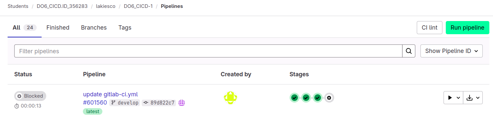
  <figcaption>Скриншот с паузой перед ручным запуском этапа deploy, ч.1</figcaption>
</figure>

<!-- -->
<figure>
  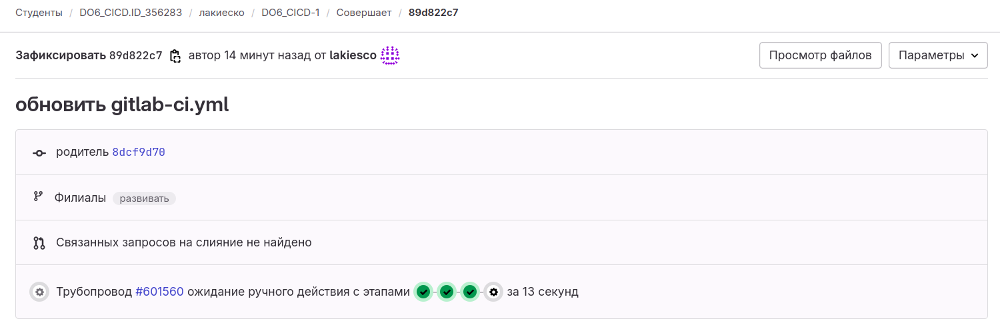
  <figcaption>Скриншот с паузой перед ручным запуском этапа deploy, ч.2</figcaption>
</figure>

<!-- -->
<figure>
  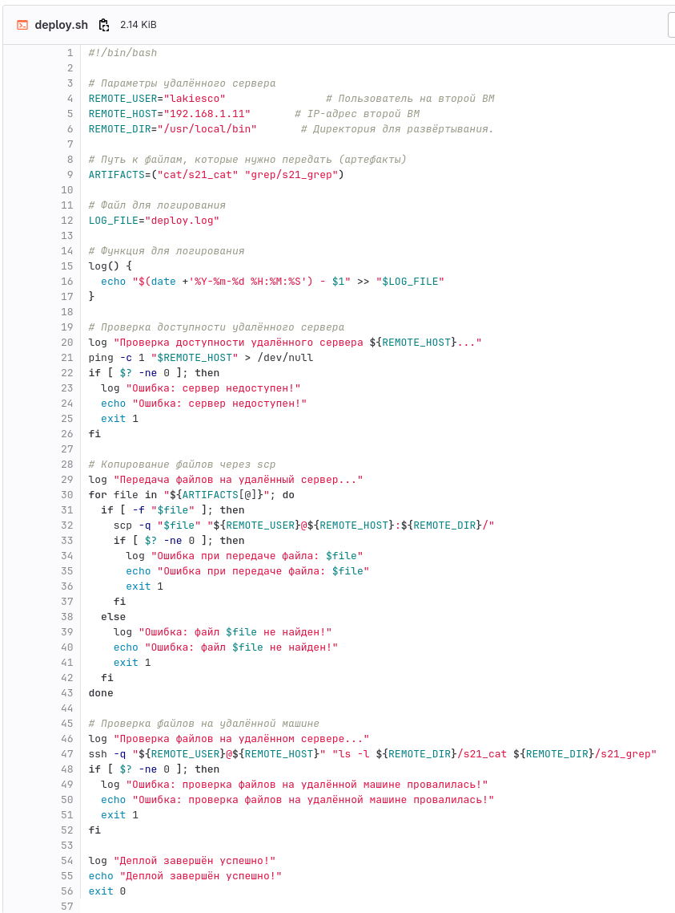
  <figcaption>Скриншот с содержанием файла скрипта</figcaption>
</figure>

<!-- -->
<figure>
  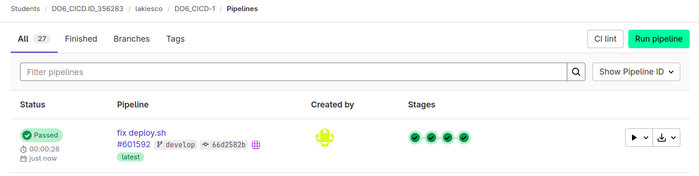
  <figcaption>Скриншот с успешным прохождением всех этапов, ч.1</figcaption>
</figure>

<!-- -->
<figure>
  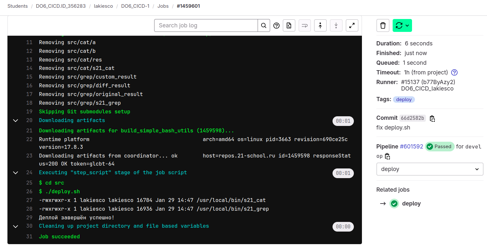
  <figcaption>Скриншот с успешным прохождением всех этапов, ч.2</figcaption>
</figure>

<!-- -->
<figure>
  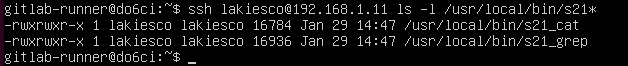
  <figcaption>Скриншот с проверкой на машине с runner'ом наличия файлов на второй машине</figcaption>
</figure>

<!-- -->
<figure>
  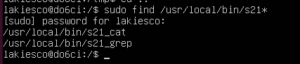
  <figcaption>Скриншот с проверкой на второй машине наличия файлов</figcaption>
</figure>

- Сохранить дампы образов виртуальных машин (не в ГИТ) = **Готово**.
   + Сделать дампы образов виртуальных машин = **Готово**.
   + Вставить скриншот выполнения дампов образов виртуальных машин = **Готово**.
   + Дампы образов виртуальных машин сохранены не в ГИТ = **Готово**. 

<!---->
<figure>
  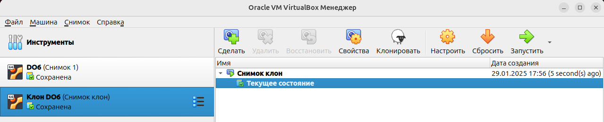
  <figcaption>Снапшот машин</figcaption>
</figure>

## Part 6. Дополнительно. Уведомления

- Настроить уведомления об успешном/неуспешном выполнении пайплайна через бота с именем «[твой nickname] DO6 CI/CD» в Telegram = **Готово**.
   + В Telegram найти пользователя @BotFather = **Готово**.
   + Отправить команды `/start` и `/newbot` для создания нового бота = **Готово**.
   + В Telegram найти созданного бота = **Готово**.
   + Отправить команду `/start` и написать к-нибудь текст, например: `Test message` для получения chat id = **Готово**.
   + Перейти по ссылке `https://api.telegram.org/bot<Полученный токен>/getUpdates` для нахождения chat id = **Готово**.

<!--
Имя: lakiesco DO6 CI/CD
Username: lakiesco_do6_cicd_bot
Получен токен: 74********************************rY
chat id: 419*******5
-->

<!---->
<figure>
  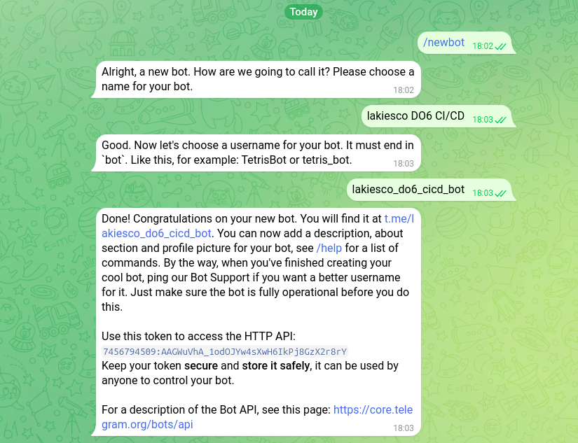
  <figcaption>Скриншот с получением API от @BotFather</figcaption>
</figure>

<!---->
<figure>
  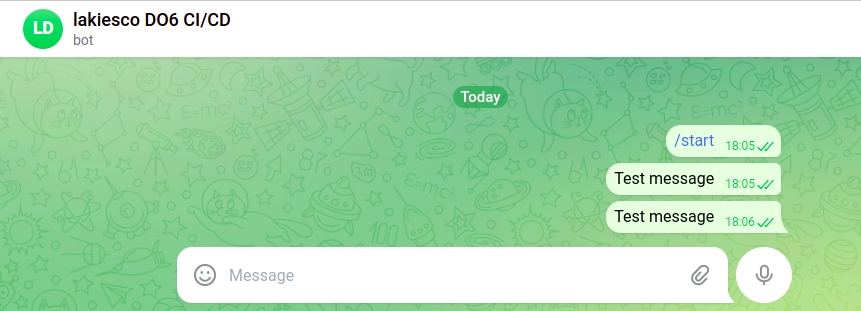
  <figcaption>Скриншот с началом работы с созданным ботом</figcaption>
</figure>

- Текст уведомления должен содержать информацию об успешности прохождения как этапа CI, так и этапа CD. В остальном текст уведомления может быть произвольным = **Готово**.
   + Выполнить команду `touch tg.sh` для создания файла скрипта = **Готово**.
   + Выполнить команду `sudo nano tg.sh` для открытия и наполнения файла = **Готово**.
   + Выполнить команду `chmod +x tg.sh` чтобы сделать файл исполняемым = **Готово**.
   + Вставить скриншот с содержанием написанного скрипта `tg.sh` = **Готово**. 

<!---->
<figure>
  
  <figcaption>Скриншот с содержанием скрипта `tg.sh`</figcaption>
</figure>

- Добавить вызов tg.sh в пайплайн для уведомлений в файл `.gitlab-ci.yml` = **Готово**. 
   + Выполнить команду `sudo nano .gitlab-ci.yml` для редактирования файла = **Готово**.
   + В редакторе nano добавляем в сборку дополнительный вызов скрипта tg.sh = **Готово**.
   + Вставить скриншот с содержанием измененного файла `.gitlab-ci.yml` = **Готово**. 
   + Запустить пайплайн для проверки работы уведомлений в tg = **Готово**.
   + Вставить скриншот с полученными уведомлениями в tg = **Готово**.  

<!---->
<figure>
  
  <figcaption>Скриншот с содержанием файла `.gitlab-ci.yml` (аналогично для test и deploy)</figcaption>
</figure>

<!-- -->
<figure>
  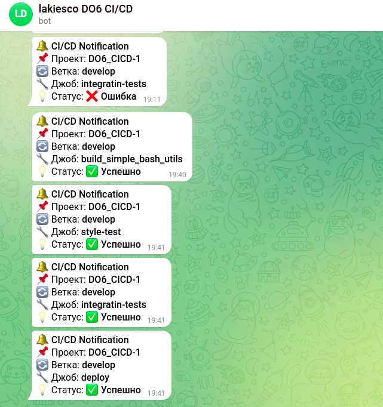
  <figcaption>Скриншот уведомлений в tg при успехе и фейле этапов пайплайна</figcaption>
</figure>

